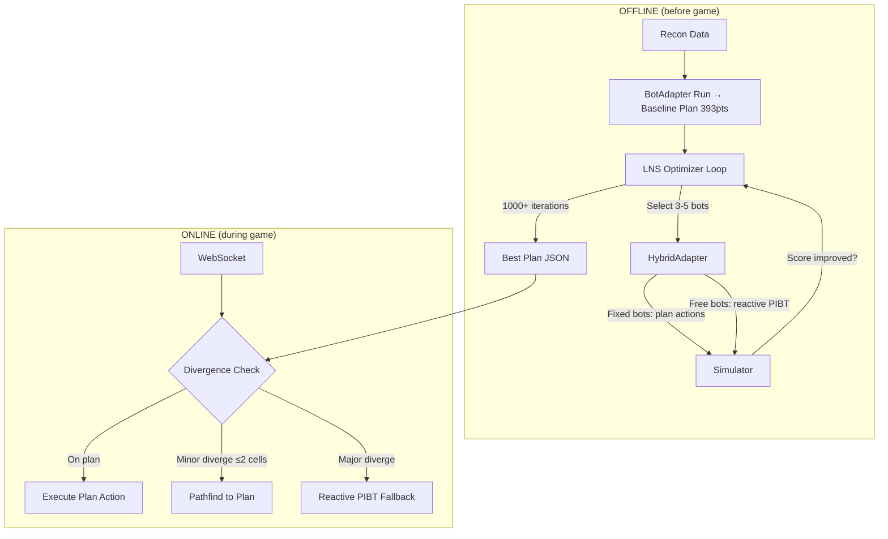

# Nightmare Master Plan — Competition March 19, 2026

> Compiled: 2026-03-17 | Based on 4 research reports + 109 experiments + live data
> Current: 393 live | Target: maximize (leader at 1767)

## Executive Summary

The gap from 393 to 1767 is **4.5x**. No single technique bridges this. The leader achieves ~3.53 score/round vs our 0.79. The root cause is clear from the data:

1. **23% wait rate** — bots spend nearly 1/4 of all rounds doing nothing
2. **51% of waits caused by IDLE bots** blocking corridors
3. **78% single-item deliveries** — capacity 3 used at 33%
4. **Pipeline depth 1** — only active + preview, 12-15 bots idle per order
5. **Spawn dispersal: 28+ rounds** before first useful work

The leader likely uses **pre-computed collision-free plans** with deep order pipelining. Our reactive PIBT system hits a physics ceiling at ~400 for nightmare.

---

## 1. Gap Analysis — Where We Lose Points

| Category | Rounds Lost | Score Impact (est.) | Evidence |
|----------|-------------|-------------------|----------|
| **IDLE bot blocking** | ~1650 waits (51% of 3303) | -150 to -200 pts | Congestion hotspot data |
| **Wait rate (non-IDLE)** | ~1650 waits (49%) | -100 to -150 pts | PIBT collisions in corridors |
| **Low delivery batching** | 78% 1-item trips | -100 to -150 pts | 2.5 items/trip → 0.78/trip |
| **Pipeline depth** | 12-15 bots idle/order | -200 to -400 pts | Only active+preview utilized |
| **Spawn dispersal** | 28-60 rounds wasted | -30 to -50 pts | First order takes 62 rounds |
| **Suboptimal routing** | ~10-15% longer paths | -50 to -80 pts | No hindrance, static guidance |
| **Drop-off utilization** | <50% time occupied | -100 to -200 pts | Gap between deliveries |
| **TOTAL GAP** | — | **~730-1230 pts** | 393 → 1123-1623 |

The biggest single lever is **eliminating IDLE bot waste** (parking + pipeline depth). The second is **delivery pipeline efficiency** (batching + drop-off utilization).

---

## 2. Prioritized Action Plan

### Tier 1: HIGH IMPACT, LOW RISK (implement first)

| # | Action | Expected Impact | Time | Risk | Dependencies |
|---|--------|----------------|------|------|-------------|
| 1 | **PIBT Hindrance metric** | +20-40 pts | 2-3h | Low | None |
| 2 | **IDLE bot parking zones** | +15-25 pts | 2-4h | Low | None |
| 3 | **Delivery batching enforcement** | +10-20 pts | 2-3h | Low | None |
| 4 | **Guidance update interval 5→1** | +3-8 pts | 30min | Low | None |

**Subtotal: +48-93 pts → ~440-490 live**

### Tier 2: HIGH IMPACT, MEDIUM RISK

| # | Action | Expected Impact | Time | Risk | Dependencies |
|---|--------|----------------|------|------|-------------|
| 5 | **LNS on captured plan** | +50-150 pts | 4-6h | Medium | Needs working BotAdapter capture |
| 6 | **Delivery relay pipeline** | +10-20 pts | 3-4h | Medium | Needs careful PIBT integration |
| 7 | **Deep pipeline (N+2 items, IDLE bots only)** | +20-40 pts | 3-4h | Medium | Must avoid dead weight trap |

**Subtotal: +80-210 pts → ~520-700 live**

### Tier 3: STRUCTURAL (high ceiling, high effort)

| # | Action | Expected Impact | Time | Risk | Dependencies |
|---|--------|----------------|------|------|-------------|
| 8 | **Full offline LNS optimizer** | +100-300 pts | 8-12h | High | LNS working + sim validation |
| 9 | **Robust hybrid replay** | +20-50 pts | 4-6h | Medium | Needs good offline plan |
| 10 | **Wave spawn dispersal** | +5-10 pts | 2-3h | Low | None |

---

## 3. Recommended Strategy — The 2-Day Plan

### Core thesis: LNS on BotAdapter capture is the ONLY path to 1000+

The research is unambiguous: competition winners ALL use the same pattern:
1. Fast initial solution (PIBT/reactive) — **we have this at 393**
2. LNS iterative improvement — **this is the missing piece**
3. Replay with fallback — **we have the MAPF replay infrastructure**

No amount of reactive PIBT tuning will cross 500. The physics of 20 bots in narrow corridors prevents it. We need collision-free pre-computed paths.

### BUT: Previous LNS attempt FAILED

The experiment log shows "LNS destroy/repair FAILS — frozen bots break PIBT cooperation" (score 279 vs 340 baseline). This was because LNS was applied at the PIBT level (freezing some bots, replanning others within PIBT).

**The correct approach is different**: LNS at the PLAN level, not the PIBT level.

```
CORRECT LNS approach:
1. Capture full 500-round plan via BotAdapter → baseline plan (393 pts)
2. Select 3-5 bots randomly
3. Remove their actions from the plan
4. Re-simulate the ENTIRE game with those bots using BotAdapter (reactive)
   while other 15-17 bots follow the fixed plan
5. If new total score > best: keep new plan
6. Repeat 1000+ times
```

This is fundamentally different from the failed PIBT-level LNS because:
- The 15-17 "fixed" bots execute pre-computed actions (not frozen in PIBT)
- The 3-5 "free" bots run full reactive BotAdapter
- The simulator handles all collision resolution
- Each iteration tests a COMPLETE game, not a partial window

### Risk: This requires modifying the simulator to support mixed fixed+reactive bots

This is non-trivial but feasible. The BotAdapter already wraps Coordinator. We need a "HybridAdapter" that:
- For fixed bots: returns pre-computed actions
- For free bots: delegates to BotAdapter
- Simulator handles collisions normally

---

## 4. Implementation Schedule

### Day 1 — Tonight (March 17, evening)

**Goal: Quick wins + LNS foundation**

| Time | Task | Expected Score |
|------|------|---------------|
| 18:00-20:00 | **Hindrance in PIBT** — add 1-step lookahead blocking check. ~20 lines in PIBTResolver. Test with sim on latest recon. | 393 → ~420 |
| 20:00-22:00 | **IDLE parking zones** — pre-compute dead-end positions far from drop-off. IDLE bots get navigation_override to parking. Test with sim. | ~420 → ~440 |
| 22:00-23:00 | **Guidance interval 5→1** + **delivery batching** (don't deliver with 1 item if 2+ available nearby). Quick wins. | ~440 → ~455 |
| 23:00-01:00 | **HybridAdapter design** — create adapter that mixes fixed-plan bots with reactive bots. Core architecture for LNS. | No score change yet |

**Run live game before bed to get fresh 03-17 recon for tomorrow's optimization.**

### Day 2 — Tomorrow (March 18)

**Goal: LNS optimization loop → best possible plan**

| Time | Task | Expected Score |
|------|------|---------------|
| 08:00-10:00 | **HybridAdapter implementation + testing** — verify mixed execution works in sim. | Foundation |
| 10:00-12:00 | **LNS optimizer loop** — 100 iterations first, verify it finds improvements. Neighborhood size 3-5 bots. | ~455 → ~500 |
| 12:00-14:00 | **Scale LNS to 1000+ iterations** — run in background while doing other work. Cherry-pick best-per-order if possible. | ~500 → ~600 |
| 14:00-16:00 | **Live validation** — run best plan via MAPF replay. Get fresh recon. Re-optimize. | Live score validation |
| 16:00-18:00 | **Iterate** — if LNS is working, keep running. If not, fall back to reactive improvements (deep pipeline, delivery relay). | Maximize |
| 18:00-20:00 | **Final live runs** — lock in best score for each difficulty before midnight order change. | Lock scores |
| 20:00-midnight | **Fresh recon after midnight** — orders change. Re-run LNS on new orders. | Competition-day plan |

### Competition Day — March 19

| Time | Task |
|------|------|
| 00:00-08:00 | LNS running overnight on fresh recon |
| 08:00-09:00 | Validate best plan live, lock scores |
| 09:00-competition | Monitor, re-run if needed |

---

## 5. What We MUST NOT Do

Based on 109 experiments and 4 research reports, these are confirmed traps:

### Proven Failures (from experiment log)
| Trap | Why It Fails | Times Tried |
|------|-------------|-------------|
| **Future N+2..N+4 picking** | Dead weight — items can't be delivered until their order is active | 3x, catastrophic |
| **Sprint/pipeline team separation** | Breaks claimed_items ordering, causes regression | 6 variants |
| **IDLE recruitment to active team** | Steals preview bots, net negative | 2x |
| **y=15 one-way (LEFT or RIGHT)** | Sim overestimates by 30+, live regression | 2x |
| **Zone partitioning with hard locks** | Sim +15, live -52 | 3x |
| **TSA* for all bots** | Reservation table fills after 2 trip rounds, 63-83% fail | 5x |
| **PIBT-level LNS (freeze+replan)** | Frozen bots break cooperative push, -61 | 1x |
| **Type-claim deduplication** | All 3 variants crash to 19 | 3x |
| **Conveyor belt for 5+ bots** | Dead weight from preview items on wrong bots | Confirmed |
| **Multi-run ensemble with noise** | Random noise gives worse, not better | 1x |
| **Aggressive heuristics without measuring** | Blacklist+threshold+penalty: 63→29 | 1x |

### Research-Informed Pitfalls
| Trap | Why to Avoid |
|------|-------------|
| **CBS/ECBS for 20 agents** | NP-hard, exponential blowup in tight corridors |
| **Full LaCAM rewrite** | 2 days isn't enough; our PIBT is already customized for game rules |
| **Optimal planning** | NP-hard at this scale; good heuristic >> slow optimal |
| **Sim-only optimization** | Sim-live gap is massive for nightmare (exp72: +24 sim / -46 live) |
| **Changing one-way aisle directions** | Must test live; sim consistently overestimates by 30+ points |
| **Changing beta or decay in guidance** | Both hurt in parameter sweep; alpha=1.0, interval=3 are locked |

### Critical Rule
**Every change MUST be validated live before locking in.** Sim-only results are unreliable for nightmare. The sim-live gap averages 30-50 points and can be 100+ in the wrong direction.

---

## 6. Fallback Strategy

If LNS doesn't work (HybridAdapter too complex, sim diverges, etc.):

### Plan B: Reactive Improvements Only (Expected: 450-550)

1. Hindrance in PIBT (+20-40)
2. IDLE parking (+15-25)
3. Delivery batching (+10-20)
4. Guidance tuning (+3-8)
5. Delivery relay pipeline (+10-20)
6. Wave spawn dispersal (+5-10)

Total: ~63-123 improvement → **~456-516 live**

This is achievable in 1 day with low risk. It won't reach 1000+, but it's a solid improvement over 393.

### Plan C: Focus on Other Difficulties

If nightmare is stuck at ~500, shift effort to easy/medium/hard/expert where smaller gains may be easier:

| Difficulty | Current Best | Potential |
|-----------|-------------|-----------|
| Easy | 124 | ~130-140 (route optimization) |
| Medium | 151 | ~160-180 (delivery timing) |
| Hard | 139 | ~150-170 (PIBT improvements) |
| Expert | — | Need baseline |
| Nightmare | 393 | ~450-600 (this plan) |

Leaderboard = SUM of all difficulties. A +30 across easy+medium+hard = +90, which may be easier than +90 on nightmare alone.

---

## 7. Key Metrics to Track

| Metric | Current | Day 1 Target | Day 2 Target |
|--------|---------|-------------|-------------|
| Wait rate | 23% | 18% | 12% |
| Items/delivery trip | 0.78 | 1.5 | 2.0 |
| Drop-off utilization | ~50% | 65% | 80% |
| Score/round | 0.79 | 1.0 | 1.5+ |
| IDLE bot % | ~60% | 40% | 20% |
| Spawn dispersal rounds | 28 | 20 | 15 |

---

## 8. Architecture Diagram



---

## 9. Decision Log

| Decision | Rationale |
|----------|-----------|
| **LNS at plan level, not PIBT level** | PIBT-level LNS failed (frozen bots). Plan-level uses full sim. |
| **Hindrance before LaCAM** | Hindrance is 20 lines, proven +40%. LaCAM is a rewrite. |
| **No deep pipeline (N+2+)** | Dead weight confirmed catastrophic 3 times. Pipeline depth 1 only. |
| **IDLE parking, not eviction** | Proactive parking > reactive eviction. Eviction already done. |
| **Live validation mandatory** | Sim-live gap averages 30-50 pts on nightmare. |
| **Don't touch one-way directions** | 2 failed experiments. Sim overestimates consistently. |
| **Focus nightmare, not spread thin** | 393→600 nightmare = +207. All other diffs combined ceiling ~+100. |

---

## 10. Success Criteria

| Outcome | Score | Verdict |
|---------|-------|---------|
| **Below 450** | <450 | Reactive improvements only, focus other diffs |
| **450-600** | 450-600 | Reactive wins worked, LNS incomplete |
| **600-900** | 600-900 | LNS working, keep iterating |
| **900+** | 900+ | Competitive, strong placement possible |

The honest assessment: reaching 1767 in 2 days is extremely unlikely. That team has likely been running offline optimization for weeks. Our realistic ceiling is **500-700 with reactive improvements**, or **700-1000 if LNS works**. Either way, every point matters for leaderboard position.
