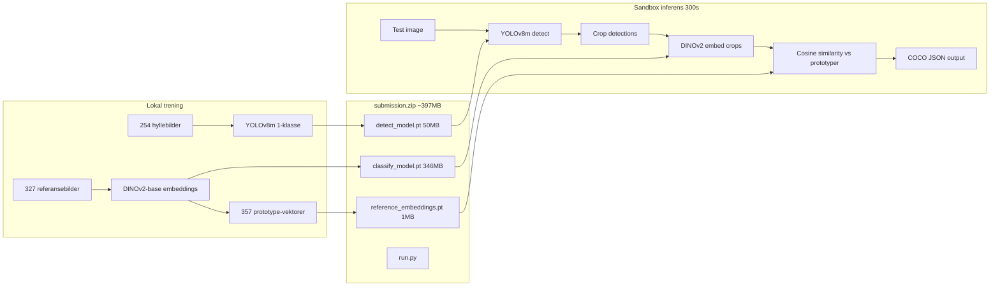

# Teknisk Evaluering: NorgesGruppen Object Detection

> Evaluert: 2026-03-19
> Rapporter generert:
> - `research/norgesgruppen-object-detection-2026-03-19.md` — Teknisk research
> - `tech-eval/norgesgruppen-architecture-2026-03-19.md` — Full arkitektur
> - `tech-eval/norgesgruppen-risks-2026-03-19.md` — Komplett risikovurdering
> - `tech-eval/norgesgruppen-mvp-spec-2026-03-19.md` — MVP-spesifikasjon

## Verdict: Gjennomforbart

## Kompleksitet: Middels

## Oppsummering

Object detection av dagligvareprodukter pa butikkhyller med 254 treningsbilder og 357 kategorier. Kjernestrategien er en two-stage pipeline: class-agnostic YOLOv8m-detektor (alle produkter som en klasse) etterfulgt av DINOv2 nearest-neighbor-klassifikasjon mot referansebilder. Scoring er 0.7 x detection + 0.3 x classification, sa deteksjonskvalitet er prioritet. Realistisk malscore: 47-62% combined mAP@0.5. Den storste tekniske risikoen er DINOv2 offline loading i sandbox via timm 0.9.12 (dokumentert bug med custom_load for ViT-modeller). Med AI-assistanse er MVP gjennomforbart pa ~1.5 dager kode + GPU-treningstid, med forste submission dag 2 kveld.

## Arkitektur (oversikt)

## Tech Stack

| Komponent | Teknologi | Versjon |
|-----------|-----------|---------|
| Detektor | YOLOv8m (class-agnostic) | ultralytics 8.1.0 |
| Feature extractor | DINOv2-base via timm | timm 0.9.12 |
| Klassifikasjon | Cosine similarity k-NN | PyTorch 2.6.0 |
| Augmentasjon | YOLOv8 built-in + albumentations | albumentations 1.3.1 |
| Ensemble (senere) | Weighted Boxes Fusion | ensemble-boxes 1.0.9 |
| GPU inferens | NVIDIA L4, CUDA 12.4 | Pre-installert i sandbox |

## Build vs Buy — Nokkelbeslutninger

| Beslutning | Valg | Begrunnelse |
|-----------|------|-------------|
| Detektor-arkitektur | YOLOv8m pre-trained + fine-tune | Pre-installert, COCO-vekter gir god start, 50MB |
| Klassifisering | DINOv2 frozen + k-NN | 93.94% retail accuracy i litteratur, ingen trening nodvendig |
| 1-klasse vs 357-klasse | 1-klasse (class-agnostic) | 0.7 bilder/klasse er for lite for multi-klasse YOLO |
| Copy-paste augmentasjon | Bygg selv (50-100 linjer) | YOLOv8 built-in krever segmenteringsmasker |
| Ensemble | Bruk ensemble-boxes WBF | Pre-installert, +1-3% mAP, men kun etter timeout-bekreftelse |

## Effort-estimat

| | Tradisjonell | AI-assistert (CC) |
|---|---|---|
| **MVP (forste submission)** | 5 dager, 1 pers | 1.5 dager, 1 pers |
| **Fase 2 (ensemble + copy-paste + iterasjon)** | 5 dager | 1.5 dager |
| **Estimert total til full optimering** | ~10 dager | ~3 dager kode + GPU-tid |

## Risikoprofil

- **Teknisk risiko:** Rod — DINOv2 offline loading er dokumentert ustabilt. Kan tvinge fallback til svakere modell.
- **Avhengighetsrisiko:** Rod — Sandbox-constraints (pinned versjoner, ingen nett, sikkerhetsscanner) er rigide og delvis udokumenterte.
- **Skaleringsrisiko:** Gronn — Irrelevant, konkurranseformat.
- **Kompetanserisiko:** Gul — AI kompenserer 70% av kodingen, men tolkning av val-kurver og augmentasjonsbeslutninger krever domeneerfaring.

## Showstoppere

1. **DINOv2 offline loading (hoy sannsynlighet):** timm 0.9.12 har `custom_load=True` default for ViT som feiler med naive `load_state_dict()`. Workaround: `pretrained_cfg_overlay=dict(file='path', custom_load=False)`. Fallback: EfficientNet-B3 (12MB).
2. **Feil COCO output-format (middels sannsynlighet):** YOLO returnerer normalisert xyxy, COCO forventer piksel xywh. Feil = 0 score uten feilmelding.

## Anbefalt vei videre

1. **Spike forst:** DINOv2 offline loading + sikkerhetsscanner + timeout-budsjett — 3-4 timer dag 1
2. **Deretter MVP:** Class-agnostic YOLOv8m + DINOv2 k-NN, forste submission dag 2 kveld
3. **Valideringspunkt:** Leaderboard-score etter forste submission — bekrefter at pipeline fungerer i sandbox
4. **Iterasjon:** Copy-paste augmentasjon, ensemble (WBF), hyperparameter-tuning basert pa leaderboard-feedback

## Infrastruktur-kostnad

| Fase | Estimat/mnd |
|------|-------------|
| Lokal trening | 0 kr (egen GPU) |
| Cloud GPU fallback | 50-150 kr per treningsokt |
| Sandbox | 0 kr (inkludert i konkurranse) |
| **Total konkurranseperiode** | **0-300 kr** |

## Vedlegg
- `research/norgesgruppen-object-detection-2026-03-19.md` — Teknisk research: modellvalg, augmentasjon, retail SOTA
- `tech-eval/norgesgruppen-architecture-2026-03-19.md` — Full arkitektur med mermaid-diagrammer, vektbudsjett, treningsplan
- `tech-eval/norgesgruppen-risks-2026-03-19.md` — 4 spikes, 6 hva-om-scenarier, 2 showstoppere
- `tech-eval/norgesgruppen-mvp-spec-2026-03-19.md` — MVP-scope, effort-estimat, proof points
