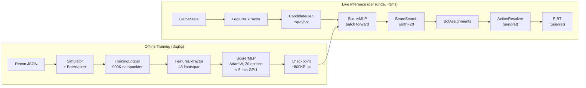

# Teknisk Evaluering: GPU-Based ML Planner for NM i AI

> Evaluert: 2026-03-16
> Rapporter generert:
> - `research/ml-planner-nightmare-2026-03-16.md` — Teknisk research
> - `tech-eval/ml-planner-architecture-2026-03-16.md` — Full arkitektur
> - `tech-eval/ml-planner-risks-2026-03-16.md` — Komplett risikovurdering
> - `tech-eval/ml-planner-mvp-spec-2026-03-16.md` — MVP-spesifikasjon

## Verdict: 🟡 Mulig med forbehold

## Kompleksitet: Middels

## Oppsummering

En Learned Scorer MLP (144K params) + Beam Search er teknisk gjennomførbart på RTX A3000 (6GB VRAM) med massiv margin — modellen bruker <3MB VRAM, inference tar ~3ms av 2000ms budget. Treningspipeline (50 sim-spill → 900K datapunkter → 5 min GPU-trening) er realistisk for daglig re-trening. **Men det er ett kritisk forbehold:** Vi vet ikke om assignment er bottlenecken. Gapet 393 → 1361 kan skyldes PIBT-kapasitet/drop-off-korridor, ikke assignment-kvalitet. Oracle-spiken (0.5 dag) avgjør om hele prosjektet gir mening. Hvis oracle > 600: grønt lys. Hvis oracle < 500: pivoter til taktisk forbedring.

## Arkitektur (oversikt)

## Tech Stack

| Komponent | Teknologi | Begrunnelse |
|-----------|-----------|-------------|
| ML framework | PyTorch 2.2+ | Native CUDA, standard for MLP-trening |
| Modell | MLP 48→256→256→128→1 (144K params) | Minimal, inference <1ms, 3MB VRAM |
| Search | Beam Search (width=20) | Global assignment, respekterer constraints |
| Treningsdata | Pickle-filer (<500MB) | Ingen database nødvendig |
| Sim | Eksisterende Simulator + BotAdapter | Allerede validert, ikke porte |
| Integrasjon | Drop-in MLPlanner | Ett-linje endring i Coordinator |

## Build vs Buy — Nøkkelbeslutninger

| Beslutning | Valg | Begrunnelse |
|-----------|-------|-------------|
| ML framework | PyTorch (eksisterende) | Eneste reelle valg for lokal CUDA-trening |
| RL framework (Fase 2) | TorchRL (BSD) | Native PyTorch, god multi-agent støtte — kun hvis Fase 2 aktiveres |
| Sim-akselerasjon | **Ikke gjør det** | Supervised learning trenger ikke rask sim. Port til JAX/CUDA er 3-5 dager risiko uten gevinst for Fase 1 |
| GNN-bibliotek (Fase 3) | torch-geometric (MIT) | Kun hvis MLP platåer og pairwise features er for svake |
| Alle nye komponenter | **Bygg selv** | Scorer, BeamSearch, FeatureExtractor er alle domenespesifikke — ingen ferdigpakker |

## Effort-estimat

| | Tradisjonell | AI-assistert (CC) |
|---|---|---|
| **MVP (Fase 1)** | 13 dager, 1 pers | **5-6 dager, 1 pers** |
| **Fase 2 (PPO, hvis platå)** | +7 dager | +4 dager |
| **Estimert total til prod** | ~20 dager | **~9-10 dager** |

## Risikoprofil

- **Teknisk risiko:** 🟢 — PyTorch-kode er standard, VRAM/timing har >95% margin, integrasjon er ett punkt
- **Bottleneck-risiko:** 🔴 — Høy sannsynlighet for at gapet mot 1361 er PIBT/taktisk, ikke assignment. Oracle-spike avgjør.
- **Supervised learning-tak:** 🟡 — Modellen kan per definisjon ikke overgå heuristikkens egne beslutninger uten DAgger/RL
- **Kompetanserisiko:** 🟢 — PyTorch er nytt for utvikler, men AI kompenserer godt (>70% på boilerplate)

## Showstoppere

1. **PIBT-kapasitetstak** (sannsynlighet: HØY) — Hvis oracle-assignment i sim gir < 500, er assignment ikke bottlenecken. ML-planner kan da maks gi +20-40 poeng — ikke de +600 som trengs. Oracle-spike (0.5 dag) avslører dette FØR noe ML-kode skrives.

2. **Supervised learning-tak** (sannsynlighet: MIDDELS) — Modellen lærer å etterligne heuristikken, ikke overgå den. Mitigering: random perturbering i treningsdata (20% suboptimale valg) + DAgger-iterasjon i Fase 1.5.

## Anbefalt vei videre

1. **Oracle-spike FØRST** (0.5 dag) — Skriv en `OracleAssigner` som med full fremtidskunnskap alltid gir nærmeste bot til riktig item. Kjør mot nightmare-recon. Resultatet avgjør alt:
   - Oracle > 600 → **Grønt lys for ML-planner**
   - Oracle 450-600 → **Gult lys** — ML hjelper noe, men taktisk forbedring trengs også
   - Oracle < 450 → **Rødt lys** — Pivoter til PIBT/MAPF-forbedring

2. **MLP proof-of-concept** (0.5 dag) — Kan scorer lære meningsfull ranking? Avslører feature-problemer tidlig.

3. **Bygg MVP** (4-5 dager) — FeatureExtractor → ScorerMLP → TrainingLogger → BeamSearch → MLPlanner

4. **Valideringspunkt:** MLPlanner scorer > 393 i sim mot recon-data = suksess. Test på recon fra annen dato for generalisering.

5. **Fase 2 trigger:** Fase 1 platåer stabilt > 500 men under oracle-tak → aktiver PPO fine-tuning.

## Infrastruktur-kostnad

| Fase | Estimat/mnd |
|------|-------------|
| MVP (lokal GPU) | ~0 kr (strøm: ~3 kWh/mnd) |
| Fase 2 PPO (lokal GPU) | ~0 kr (strøm: ~30 kWh/mnd) |
| Live inference | ~0 kr (del av eksisterende maskin) |

Alt kjører lokalt. Ingen sky-infrastruktur.

## Vedlegg
- `research/ml-planner-nightmare-2026-03-16.md` — Full teknisk research (MAPF-RL, arkitekturer, open source)
- `tech-eval/ml-planner-architecture-2026-03-16.md` — Komplett arkitektur med mermaid, state encoding, effort-estimat
- `tech-eval/ml-planner-risks-2026-03-16.md` — Risikovurdering med 4 spikes, 5 hva-om-scenarier, showstoppere
- `tech-eval/ml-planner-mvp-spec-2026-03-16.md` — MVP-spesifikasjon med scope, effort, proof points
