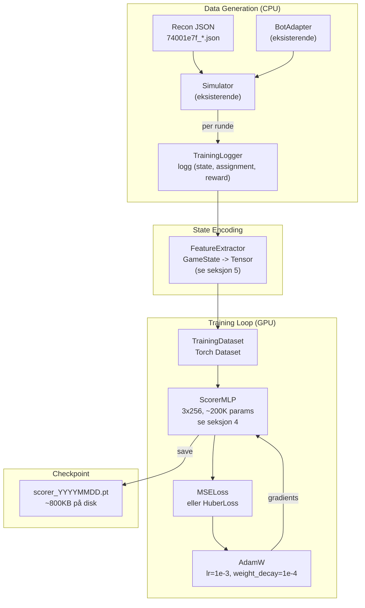
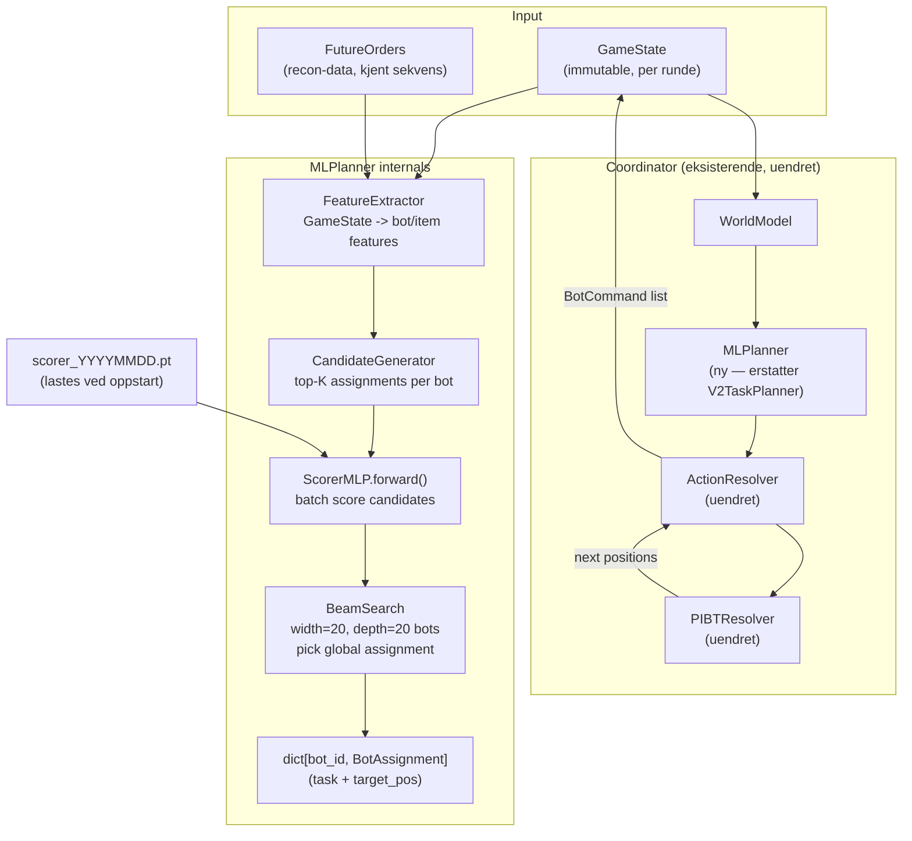
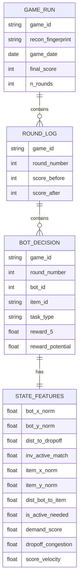

# Teknisk Arkitektur: GPU-Based ML Planner — NM i AI Nightmare (20 bots)

> Utarbeidet: 2026-03-16 | Basert på: `research/ml-planner-nightmare-2026-03-16.md`, kodebase-gjennomgang, recon-data `74001e7f`

---

## Oppsummering

Nåværende heuristikk (zone-strategi + greedy nearest + Hungarian) gir 393 poeng mot ledelsens 1361. Gapet er 3.46x — for stort til å tettes med parameter-tuning alene. Denne arkitekturen erstatter `bot/strategy/v2/planner.py` med en **Learned Scorer + Beam Search**-planner som tar hele ordersekvensen som input og scorer bot-item assignments med et lite MLP. PIBT, ActionResolver, BotAdapter og simulatoren beholdes uendret. Systemet trener på recon-data (kjent sekvens, ~30 ordrer per dag) og inference er <5ms per runde — mye innenfor 2s budsjettet. Faseoppdeling: Fase 1 (scorer + beam search, 3-4 dager) gir estimert +50-200 poeng uten RL-risiko. Fase 2 (imitation learning + PPO fine-tuning) aktiveres kun hvis fase 1 platåer.

---

## 1. Systemarkitektur

### 1.1 Treningspipeline (offline)



### 1.2 Inference-pipeline (per runde, live)



### 1.3 Komponentoversikt

| Komponent | Hva den gjør | Ny/Eksisterende |
|-----------|-------------|-----------------|
| `ScorerMLP` | Scorer (bot, item)-par basert på state-features | **NY** |
| `FeatureExtractor` | GameState → float-tensorer, håndterer alle encodings | **NY** |
| `CandidateGenerator` | Genererer top-K kandidat-items per bot (BFS-filtrert) | **NY** |
| `BeamSearch` | Kombinatorisk søk over global assignment, bruker scorer | **NY** |
| `TrainingLogger` | Logger (state, assignment, reward) under sim-kjøring | **NY** |
| `MLPlanner` | Drop-in replacement for V2TaskPlanner — koordinerer pipeline | **NY** |
| `TrainRunner` | Treningsloop: dataset → model → checkpoint | **NY** |
| `V2TaskPlanner` | Nåværende planner — erstattes av MLPlanner | Erstattes |
| `PIBTResolver` | Collision-free movement | Uendret |
| `ActionResolver` | tasks → BotCommand | Uendret |
| `Coordinator` | Orchestrator, eier persistent state | Minimale endringer |
| `BotAdapter` | Wraps Coordinator for Simulator | Uendret |
| `Simulator` | Validert sim for trening | Uendret |
| `GameLogger` | Recon-data innsamling | Uendret |

---

## 2. Tech Stack

| Lag | Teknologi | Versjon | Begrunnelse |
|-----|-----------|---------|-------------|
| ML framework | **PyTorch** | >=2.2 | Allerede tilgjengelig i Python-ekoystem, native CUDA support for RTX A3000 (compute 8.6), ikke overkill som JAX |
| Modell | **MLP (nn.Module)** | — | 200K params, trivielt innenfor 6GB VRAM, inference <1ms, ingen ekstern avhengighet |
| Treningsloop | **Ren PyTorch** (ingen RL-framework) | — | Supervised learning på (state, assignment, reward) — trenger ikke TorchRL/CleanRL overhead |
| Data | **torch.utils.data.Dataset** | — | Standardbibliotek, ingen ny avhengighet |
| Optimizer | **AdamW** | — | Standard for MLP-trening, god regularisering |
| GPU | **CUDA via PyTorch** | CUDA 11.8+ | RTX A3000, compute 8.6, Ampere-støtte |
| Serialisering | **torch.save / torch.load** | — | Checkpoint er ~800KB, ingen spesiell infrastruktur |
| Eksisterende | **Python 3.13, scipy, numpy** | — | Beholdes uendret |

**Ikke i stacken (og hvorfor):**
- Ikke JAX/JaxMARL — krever full sim-port (2-4 dager risiko), unødvendig
- Ikke TorchRL/CleanRL — RL-overhead for et supervised-learning-problem
- Ikke RLlib — overkill, single-GPU
- Ikke ONNX Runtime — PyTorch eager er rask nok (<1ms for 200K params)

---

## 3. Build vs Buy

| Komponent | Bygg selv | Open Source | Anbefaling + begrunnelse |
|-----------|-----------|-------------|--------------------------|
| MLP scorer | ~1 dag | PyTorch `nn.Module` | **PyTorch** — 20 linjer kode, full kontroll over arkitektur |
| Beam search | ~0.5 dag | Ingen aktuell | **Bygg** — domenespesifikk (bot-assignment constraints, inventory caps), generiske beam search-biblioteker passer ikke direkte |
| Feature encoding | ~1 dag | Ingen aktuell | **Bygg** — tett koblet til GameState-datastrukturer |
| Treningsloop | ~0.5 dag | PyTorch DataLoader | **Bygg med PyTorch** — ingen ekstern ML-platform nødvendig |
| Imitation learning (Fase 2) | ~2 dager | `imitation`-biblioteket (MIT) | **imitation-lib** for fase 2 — ren BC/DAgger uten å finne opp hjulet |
| PPO fine-tuning (Fase 2) | ~3 dager | `stable-baselines3` (MIT) eller TorchRL (MIT) | **TorchRL** om fase 2 aktiveres — native PyTorch, god multi-agent tutorial |
| GNN (Fase 3) | ~3 dager | `torch-geometric` (MIT) | Bygg med torch-geometric hvis fase 2 platåer |
| Sim-akselerasjon | 3-5 dager | WarpDrive / JaxMARL | **Ikke nå** — supervised learning trenger ikke rask sim |

---

## 4. Modellarkitektur

### 4.1 ScorerMLP — primærmodell (Fase 1)

Scorer kvaliteten av ett (bot, item)-par i kontekst av global state.

```
Input: [bot_features | item_features | global_features]
       = [14 | 12 | 22] = 48 floats per pair

Architecture:
  Linear(48, 256) -> LayerNorm(256) -> ReLU
  Linear(256, 256) -> LayerNorm(256) -> ReLU
  Linear(256, 128) -> ReLU
  Linear(128, 1)   -> sigmoid (score in [0, 1])

Parameters: 48*256 + 256*256 + 256*128 + 128*1 ≈ 144K params
VRAM (inference): ~6MB (weights) + activations for 20*60=1200 pairs = trivielt
VRAM (training):  ~50MB inkl. optimizer state
Training target:  Normalized score = future_score_5_rounds / max_possible_5_rounds
Loss:             HuberLoss (robust mot outliers fra suboptimale heuristikk-valg)
```

### 4.2 Fase 2-utvidelse: PolicyHead

Legges til ScorerMLP etter at scorer er ferdigtrent, for PPO fine-tuning:

```
Delt encoder (fryst i BC-fase):
  Linear(48, 256) -> LayerNorm -> ReLU
  Linear(256, 256) -> LayerNorm -> ReLU

Scorer-head (Fase 1):
  Linear(256, 128) -> ReLU -> Linear(128, 1) -> sigmoid

Policy-head (Fase 2, ny):
  Linear(256, 64) -> ReLU -> Linear(64, 1) -> softmax over items per bot

Value-head (MAPPO centralized critic, Fase 2, ny):
  Input: global_state_vector (22 floats * 20 bots = 440)
  Linear(440, 256) -> ReLU -> Linear(256, 1)
```

### 4.3 VRAM-estimat

| Komponent | VRAM |
|-----------|------|
| ScorerMLP weights (144K params, fp32) | 0.6 MB |
| Batch inference: 1200 pairs x 48 floats | 0.2 MB |
| Training batch (1024 samples) | 0.5 MB |
| Optimizer state (AdamW = 2x params) | 1.2 MB |
| **Total Fase 1** | **~3 MB** |
| PolicyHead + ValueHead (Fase 2) | +50 MB |
| PPO experience buffer (10K rollouts) | +200 MB |
| **Total Fase 2** | **~250 MB** |
| **RTX A3000 kapasitet** | **6144 MB** |
| **Headroom** | **>95%** |

---

## 5. State Encoding — GameState → Tensor

### 5.1 Bot features (14 floats per bot)

```python
# Posisjon, normalisert til [0,1]
bot_x_norm       = bot.position[0] / (grid.width - 1)    # float
bot_y_norm       = bot.position[1] / (grid.height - 1)   # float

# Distanse til nærmeste drop-off, normalisert
dist_to_dropoff  = bfs_dist(bot.pos, nearest_dropoff) / max_dist  # float

# Inventory-status
inv_size         = len(bot.inventory) / 3.0              # float [0,1]
inv_active_match = count_active_matches(bot) / 3.0       # float [0,1]
inv_preview_match= count_preview_matches(bot) / 3.0      # float [0,1]

# Current task encoding (one-hot, 4 dims)
task_pickup      = 1.0 if task == PICK_UP else 0.0
task_deliver     = 1.0 if task == DELIVER else 0.0
task_prepick     = 1.0 if task == PRE_PICK else 0.0
task_idle        = 1.0 if task == IDLE else 0.0

# Congestion: antall andre bots innen radius 3
nearby_bots      = count_bots_within_radius(bot, 3) / 20.0  # float [0,1]

# Runde-info
round_norm       = state.round / state.max_rounds         # float [0,1]
rounds_left_norm = state.rounds_remaining / state.max_rounds  # float [0,1]

# Bot ID for prioritetshensyn (lav ID = høy PIBT-prioritet)
bot_id_norm      = bot.id / 20.0                          # float [0,1]
```

### 5.2 Item features (12 floats per item)

```python
# Posisjon
item_x_norm      = item.position[0] / (grid.width - 1)   # float
item_y_norm      = item.position[1] / (grid.height - 1)  # float

# Distanse fra denne boten til item
dist_bot_to_item = bfs_dist(bot.pos, item.pos) / max_dist  # float

# Distanse fra item til nærmeste drop-off
dist_item_to_do  = bfs_dist(item.pos, nearest_dropoff) / max_dist  # float

# Er item av type som trengs i aktiv ordre?
is_active_needed = 1.0 if item.type in active_remaining else 0.0  # float

# Antall av denne typen som gjenstår i aktiv ordre
active_count_needed = active_remaining.count(item.type) / 7.0  # float [0,1]

# Er item av type som trengs i preview ordre?
is_preview_needed = 1.0 if item.type in preview_remaining else 0.0  # float

# Demand score: hvor mange av de neste N ordrene trenger denne typen
demand_score     = demand[item.type] / 8.0               # float [0,1]

# Er item allerede claimet av en annen bot?
is_claimed       = 1.0 if item.id in claimed_items else 0.0  # float

# Antall andre bots nærmere dette item enn denne boten
bots_closer      = count_bots_closer(bot, item) / 20.0   # float [0,1]

# Item type embedding (one-hot ville vært 21 dims, bruk index-normalisert)
item_type_norm   = type_index(item.type) / 21.0           # float [0,1]

# Congestion rundt item-posisjonen
item_congestion  = count_bots_within_radius(item.pos, 2) / 20.0  # float [0,1]
```

### 5.3 Global features (22 floats)

```python
# Ordre-progress
active_remaining_count  = len(active_remaining) / 7.0    # float
preview_remaining_count = len(preview_remaining) / 7.0   # float
orders_completed        = orders_done / max_orders        # float

# Pipeline status
bots_delivering    = count_bots_delivering() / 20.0      # float
bots_picking       = count_bots_picking() / 20.0         # float
bots_prepicking    = count_bots_prepicking() / 20.0      # float
bots_idle          = count_bots_idle() / 20.0            # float

# Fremtidsinfo (NØKKELFORDEL — kjent ordersekvens!)
next_order_types   = type_distribution(orders[+1]) / 7.0  # 7 floats (en per type-bucket)
# Aggregert som: how many of next order match items already in bot-inventories collective
collective_next_match = count_collective_match(next_order) / 7.0  # float

# Congestion rundt drop-off (kritisk for nightmare)
dropoff_congestion = count_bots_within_radius(dropoff, 4) / 20.0  # float

# Drop-off zone occupancy (nightmare har 3 zones)
zone1_occupied     = 1.0 if zone1_pos in occupied_positions else 0.0
zone2_occupied     = 1.0 if zone2_pos in occupied_positions else 0.0
zone3_occupied     = 1.0 if zone3_pos in occupied_positions else 0.0

# Score velocity: poeng per runde (gjennomsnitt siste 10 runder)
score_velocity     = recent_score_per_round / 2.0         # float (norm: maks ~2 poeng/runde)
```

**Total inputstørrelse per (bot, item)-pair:** 14 + 12 + 22 = **48 floats**

---

## 6. Action Decoding — Model Output → BotAssignment

```
BeamSearch tar scorer-output og produserer global assignment.
Beam width = 20, depth = antall bots (20).
Per expansion: hvert leaf evalueres av ScorerMLP i batch.

Prosess per runde (pseudo-Python):
  candidates = generate_top_k_items_per_bot(k=5)  # BFS-filtrert
  # candidates: dict[bot_id -> list[item_id | DELIVER | IDLE]]

  beam = [(score=0.0, assignment={})]
  for bot in bots_sorted_by_priority:
      new_beam = []
      for partial_score, partial_assign in beam:
          for action in candidates[bot.id]:
              features = encode(state, bot, action, partial_assign)
              action_score = scorer.forward(features)
              new_beam.append((partial_score + action_score, partial_assign | {bot.id: action}))
      beam = top_20(new_beam)  # prune

  best_assignment = beam[0].assignment

  # Konverter til BotAssignment (samme format som V2TaskPlanner output)
  for bot_id, action in best_assignment.items():
      if action == DELIVER:
          assignments[bot_id].task = Task(DELIVER, nearest_dropoff(...))
      elif action == IDLE:
          assignments[bot_id].task = Task(IDLE, queue_pos(...))
      else:
          item = state.get_item(action)
          task_type = PICK_UP if item.type in active_remaining else PRE_PICK
          assignments[bot_id].task = Task(task_type, pickup_pos(item), item_id=item.id, ...)
```

**Merk:** Beam search preserverer to invarianter fra eksisterende arkitektur:
1. `claimed_items`-settet oppdateres per expansion — ingen double-booking
2. PIBT urgency-tiers beregnes fra output (DELIVER=0, PICK_UP=1, PRE_PICK=2) — ingen endring i ActionResolver

---

## 7. Treningspipeline

### 7.1 Datafangst

```bash
# Kjør BotAdapter med TrainingLogger 50 ganger mot siste recon
py -m ml.collect_training_data \
  --recon logs/74001e7f_2026-03-16_score274_recon.json \
  --n-games 50 \
  --output data/training_74001e7f_2026-03-16.pkl
```

Hvert datapunkt:
```
{
  "state_features": float[48],     # encoded (bot, item) pair
  "bot_id": int,
  "item_id": str | "DELIVER" | "IDLE",
  "reward_5": float,               # actual score delta over next 5 rounds (normalized)
  "round": int,
  "game_id": int
}
```

Per spill: ~300 runder × 20 bots × 3 kandidater ≈ **18,000 datapunkter**. 50 spill = **900K datapunkter**. Nok for 200K-params MLP.

### 7.2 Reward-label

```python
# reward_5 = faktisk score-delta 5 runder frem
# Beregnes i ettertid fra logged state-sekvens
reward_5 = (score_at_round_t_plus_5 - score_at_round_t) / 10.0  # normalisert

# Potential-based shaping (tettere signal):
# phi(s) = -sum(bfs_dist(bot.pos, bot.target) for bot in bots)
# shaped_reward = gamma * phi(s') - phi(s) + actual_reward
```

### 7.3 Treningsloop

```python
# Estimert treningstid: 900K samples, batch=256, 20 epochs
# = 900K/256 * 20 ≈ 70,000 steps
# RTX A3000: ~50K steps/sek for 200K MLP → ~1.4 sekunder total
# Med dataloading og checkpointing: < 5 minutter

optimizer = AdamW(model.parameters(), lr=1e-3, weight_decay=1e-4)
scheduler = CosineAnnealingLR(optimizer, T_max=n_epochs)
loss_fn = nn.HuberLoss(delta=0.1)

for epoch in range(20):
    for batch in dataloader:
        features, rewards = batch
        pred = model(features)
        loss = loss_fn(pred.squeeze(), rewards)
        loss.backward()
        optimizer.step()
        optimizer.zero_grad()
    scheduler.step()
    # Validate on held-out 10% of data
```

### 7.4 Daglig retraining workflow

```bash
# 1. Spill live game for ny recon (kl 00:01 UTC etter daily reset)
py main.py --url "wss://..." --map nightmare  # samler ny recon automatisk

# 2. Generer treningsdata
py -m ml.collect_training_data --recon logs/74001e7f_$(date +%Y-%m-%d)_*.json --n-games 50

# 3. Tren modell
py -m ml.train --data data/training_74001e7f_$(date +%Y-%m-%d).pkl --output models/

# 4. Kjør live med ny modell
py main.py --url "wss://..." --map nightmare  # Coordinator laster siste checkpoint
```

Total daglig overhead: ~30 min (50 offline sim-spill + 5 min trening).

---

## 8. Inference-integrasjon — Coordinator

### 8.1 Endringer i Coordinator (minimale)

```python
# bot/coordinator.py — kun tre steder endres:

# 1. Import (linje ~30)
from bot.strategy.ml_planner import MLPlanner  # NY

# 2. __init__: erstatt TaskPlanner med MLPlanner
self._planner = MLPlanner(model_dir=Path("models/"))  # erstatter TaskPlanner()

# 3. Ingenting annet — MLPlanner implementerer samme interface:
#    plan(world, assignments, events) -> None
#    maintain(state, assignments) -> None
```

MLPlanner er et drop-in replacement. ActionResolver, PIBT, WorldModel, recon-logger — alt uendret.

### 8.2 MLPlanner fallback

```python
class MLPlanner:
    def __init__(self, model_dir: Path) -> None:
        self._scorer = ScorerMLP()
        ckpt = self._find_latest_checkpoint(model_dir)
        if ckpt:
            self._scorer.load_state_dict(torch.load(ckpt, map_location="cuda"))
            self._scorer.eval()
            self._use_ml = True
        else:
            # Fallback til heuristikk hvis ingen checkpoint finnes
            self._fallback = V2TaskPlanner()
            self._use_ml = False

    def plan(self, world, assignments, events):
        if self._use_ml:
            return self._ml_plan(world, assignments, events)
        return self._fallback.plan(world, assignments, events)
```

### 8.3 Timing

```
Per runde, nightmare (20 bots, ~60 items):
  FeatureExtractor:        ~0.5ms   (20 bots * 60 items * 48 floats)
  CandidateGenerator:      ~0.5ms   (BFS-filtrering, topp 5 per bot)
  ScorerMLP.forward():     ~0.1ms   (batch av 1200 pairs, GPU)
  BeamSearch:              ~1-2ms   (20 bots, width=20)
  Total MLPlanner:         ~3ms

  Budget:                  2000ms
  Headroom:                ~99.85%
```

---

## 9. Datamodell (treningsinfrastruktur)



Data lagres som `.pkl`-filer (Python pickle, binært) under `data/`. Ingen database nødvendig — datasettene er <500MB.

---

## 10. Integrasjonspunkter og risikovurdering

| Integrasjon | Hva | Risiko | Mitigering |
|------------|-----|--------|-----------|
| PyTorch CUDA | GPU-akselerert inference og trening | **Lav** — RTX A3000 er støttet, compute 8.6 | Test med `torch.cuda.is_available()` ved oppstart |
| BotAdapter-grensesnitt | MLPlanner mottar WorldModel, returnerer BotAssignment | **Lav** — samme interface som V2TaskPlanner | MLPlanner implementerer identisk signatur |
| Recon-data format | JSON-format fra GameLogger er input til treningsdatagen | **Lav** — format er stabilt og validert | `FeatureExtractor` testes mot kjente recon-filer |
| Checkpoint-lasting | Coordinator laster `.pt`-fil ved oppstart | **Medium** — feil checkpoint kan gi dårlig policy | Alltid fallback til V2TaskPlanner hvis checkpoint mangler |
| Daglig orderskifte | Modell trent på gårsdagens ordrer, brukt på dagens | **Medium** — transferability avhenger av generalisering | Retraining workflow er automatisert, scorer generaliserer over item-types ikke item-IDs |
| Sim-live gap | Sim kan avvike fra server på kantsituasjoner | **Lav** — sim er validert, kollisonsmodell er testet | TrainingLogger kan også logge live-games for kalibrering |

---

## 11. Infrastruktur & Kostnad

Systemet kjører helt lokalt — ingen sky-infrastruktur nødvendig.

| Fase | Beskrivelse | Lokal kostnad/dag | Komponenter |
|------|------------|-------------------|-------------|
| Trening (Fase 1) | 50 offline sim-spill + 5 min GPU-trening | Strøm: ~0.05 kWh | CPU sim + RTX A3000 GPU |
| Inference (live game) | 300 runder, <3ms per runde | Negligibelt | RTX A3000 (laster ~3MB model) |
| Dataproduksjon | 50 sim-spill mot recon-data | ~10 min CPU | BotAdapter + Simulator |
| Totalt per dag | — | ~30 min tid, ~0.1 kWh | — |

For PPO fine-tuning (Fase 2): 4-12 timer GPU-trening, ~1-3 kWh, fortsatt lokalt.

---

## 12. Effort-estimat

### 12.1 Tradisjonell utvikling

| Komponent | Estimat | Kommentar |
|-----------|---------|-----------|
| FeatureExtractor (48 floats, full encoding) | 3 dager | Domenekunnskap + edge cases i encoding |
| ScorerMLP + treningsloop | 2 dager | Standard PyTorch boilerplate |
| TrainingLogger (datafangst i sim) | 1 dag | Integrasjon mot BotAdapter |
| CandidateGenerator | 1 dag | BFS-filtrering, constraint-håndtering |
| BeamSearch over assignments | 2 dager | Kombinatorisk søk med constraints (inventory caps, claimed_items) |
| MLPlanner (drop-in Coordinator-integrasjon) | 1 dag | Interface-matching + fallback |
| Daglig retraining CLI | 1 dag | Workflow-scripting |
| Testing + validering mot recon | 2 dager | Sikre at encoding er korrekt, scorer gir fornuftige scorer |
| **Totalt Fase 1** | **~13 dager** | 1 utvikler |

| Komponent (Fase 2) | Estimat | Kommentar |
|-------------------|---------|-----------|
| PettingZoo/TorchRL wrapper for Simulator | 2 dager | Adapter mot RL-framework |
| MAPPO med centralized critic | 3 dager | Multi-agent PPO, reward shaping |
| PPO fine-tuning + hyperparameter search | 2 dager | Iterasjon på belønningsstruktur |
| **Totalt Fase 2** | **~7 dager** | Forutsetter Fase 1 ferdig |

**Totalt tradisjonell: ~20 dager med 1 utvikler**

---

### 12.2 AI-assistert utvikling (Claude Code)

| Komponent | Tradisjonell | AI-assistert | Reduksjon | Forutsetninger |
|-----------|-------------|--------------|-----------|----------------|
| FeatureExtractor (boilerplate encoding) | 3 dager | 1 dag | ~67% | AI genererer float-encoding raskt, utvikler validerer logikk |
| ScorerMLP + treningsloop | 2 dager | 0.5 dag | ~75% | Standard PyTorch, AI sweet spot |
| TrainingLogger | 1 dag | 0.5 dag | ~50% | Integrasjon mot eksisterende klasser |
| CandidateGenerator | 1 dag | 0.5 dag | ~50% | BFS-kall er allerede definert |
| BeamSearch | 2 dager | 1 dag | ~50% | Kombinatorisk logikk + constraints — domenespesifikk |
| MLPlanner (integrasjon) | 1 dag | 0.5 dag | ~50% | Boilerplate, interface-matching |
| Daglig retraining CLI | 1 dag | 0.25 dag | ~75% | Script-generering er AI sweet spot |
| Testing + validering | 2 dager | 1 dag | ~50% | Test-generering, men domenespesifikk validering er manuell |
| **Totalt Fase 1** | **13 dager** | **5-6 dager** | **~57%** | 1 utvikler med Claude Code aktivt |
| Fase 2 (PPO fine-tuning) | 7 dager | 4 dager | ~43% | Reward shaping er domenespesifikk — lavere AI-gevinst |
| **Totalt Fase 1 + 2** | **~20 dager** | **~9-10 dager** | **~52%** | |

**Estimat-forutsetninger:**
- Utvikler bruker Claude Code aktivt for boilerplate (encodings, treningsloop, CLI)
- Domenespesifikke beslutninger (feature-valg, reward-shaping, constraint-logikk i beam search) krever fortsatt menneskelig vurdering
- Testing mot faktiske recon-filer kan ikke automatiseres bort — scorer må valideres manuelt
- Fase 2 (PPO) har høy iterasjonsrisiko — reward shaping kan ta lang tid uansett verktøy

---

## 13. Faseoppdeling — hva bygges når

### Fase 1: Learned Scorer + Beam Search (5-6 dager med AI-assistert)

**Mål:** Erstatt greedy nearest assignment med lært scorer. Bevar all annen logikk.

1. `ml/feature_extractor.py` — GameState → float-tensorer
2. `ml/scorer.py` — ScorerMLP (nn.Module)
3. `ml/collect_training_data.py` — TrainingLogger + datafangst via BotAdapter
4. `ml/train.py` — treningsloop
5. `bot/strategy/ml_planner.py` — MLPlanner (drop-in for V2TaskPlanner)
6. Minimal endring i `bot/coordinator.py` — bytt ut planner-instans

**Suksesskriterium:** `py -m Simulering.offline.run_offline --recon logs/74001e7f_*` gir score > 393.

**Breakeven:** Scorer + beam search slår greedy nearest hvis den klarer å prioritere bots med riktig inventorytype til delivery fremfor bots som er nærmest men uten match. Dette er dokumentert low-hanging fruit i gap-analysen.

---

### Fase 2: Imitation Learning + PPO (4 dager, aktiveres ved platå)

**Mål:** Fine-tune scorer med RL for å bryte ut av heuristikkens tak.

1. PettingZoo-wrapper rundt Simulator
2. MAPPO med centralized critic (global state)
3. Reward: +1 item, +5 order, potential-based shaping (distance reduction)
4. Bootstrap fra Fase 1-scorer (lader encoder-vekter)

**Aktiver kun hvis:** Fase 1 scorer stabilt over 500 i sim og live, og platåer.

---

### Fase 3: GNN Bipartite Assignment (5-7 dager, langsiktig)

**Mål:** Erstatt MLP med GNN for å utnytte graph-struktur (bots og items som noder, edges = BFS-distanser).

**Aktiver kun hvis:** Analyse av Fase 2-scorer viser at pairwise features (bot, item) ikke er rik nok — at modellen trenger å se alle bots og items simultant.

---

## 14. Arkitekturbeslutninger (ADRs)

### ADR-1: Supervised learning (ikke RL) for Fase 1

- **Kontekst:** Ordresekvensen er kjent og deterministisk per dag. Vi har validert sim og eksisterende heuristikk.
- **Beslutning:** Fase 1 bruker supervised learning på (state, assignment, reward_5)-tripletter — ikke RL.
- **Konsekvenser:** Scorer kan ikke overstige heuristikkens tak uten DAgger-iterasjon. Men: treningsdata er rik (50 spill = 900K datapunkter), trening er <5 min, ingen reward shaping-problematikk, ingen credit assignment-problem. Enklest mulig vei til bedre-enn-greedy.

### ADR-2: MLP, ikke GNN, for Fase 1

- **Kontekst:** GNN er mer naturlig for bipartite assignment (se MAGNET-paper), men krever PyTorch Geometric og mer kompleks implementasjon.
- **Beslutning:** MLP (48 floats) for Fase 1. GNN vurderes i Fase 3.
- **Konsekvenser:** MLP kan ikke direkte modellere bot-til-bot-interaksjoner, men global_features-vektoren (22 floats) inkluderer aggregerte mål for dette. Fase 1 kan bygges og testes på < 1 dag.

### ADR-3: Beam search over assignments, ikke greedy decode

- **Kontekst:** Greedy decode (velg beste item per bot, én om gangen) ignorerer at bots konkurrerer om samme items. Resultat: suboptimale kombinasjoner.
- **Beslutning:** Beam search med width=20 over global assignment. Scorer kalles i batch.
- **Konsekvenser:** O(bots × items × beam_width) scorerkall per runde. For 20 bots, 60 items, width=20: maks 24,000 forward passes. I praksis langt færre (kandidater filtreres til topp-5 per bot). Total tid <5ms.

### ADR-4: Drop-in replacement via identisk interface

- **Kontekst:** Coordinator eier pipeline. V2TaskPlanner og MLPlanner er utskiftbare.
- **Beslutning:** MLPlanner implementerer nøyaktig samme `plan()` og `maintain()`-signaturer. Coordinator endres på ett sted (`__init__`).
- **Konsekvenser:** Eksisterende tester for Coordinator, ActionResolver og PIBT er uendret. Enkelt å rulle tilbake.

### ADR-5: Ingen JAX/CUDA-port av simulatoren

- **Kontekst:** RL-tilnærminger (JaxMARL, WarpDrive) krever 100-1000x raskere sim for å trene på timer.
- **Beslutning:** Supervised learning (Fase 1) og PPO med CPU-parallelisering (Fase 2) gir tilstrekkelig treningsdata uten sim-port.
- **Konsekvenser:** Fase 2 PPO-trening tar 4-12 timer (8-16 parallelle CPU-envs via SubprocVecEnv) fremfor minutter. Akseptabelt for daglig retraining. Unngår 3-5 dagers risikofylt portingsarbeid.

### ADR-6: Daglig retraining som workflow, ikke som streaming

- **Kontekst:** Ordresekvensen endres kl 00:00 UTC. Ny recon + ny modell trengs innen første live-game neste dag.
- **Beslutning:** Koordinert CLI-workflow: spill recon-game → generer data → tren → bruk. Kjøres manuelt eller via enkel cron.
- **Konsekvenser:** Ingen streaming learning, ingen online adaptation. Tilstrekkelig for daglig reset-syklus.
