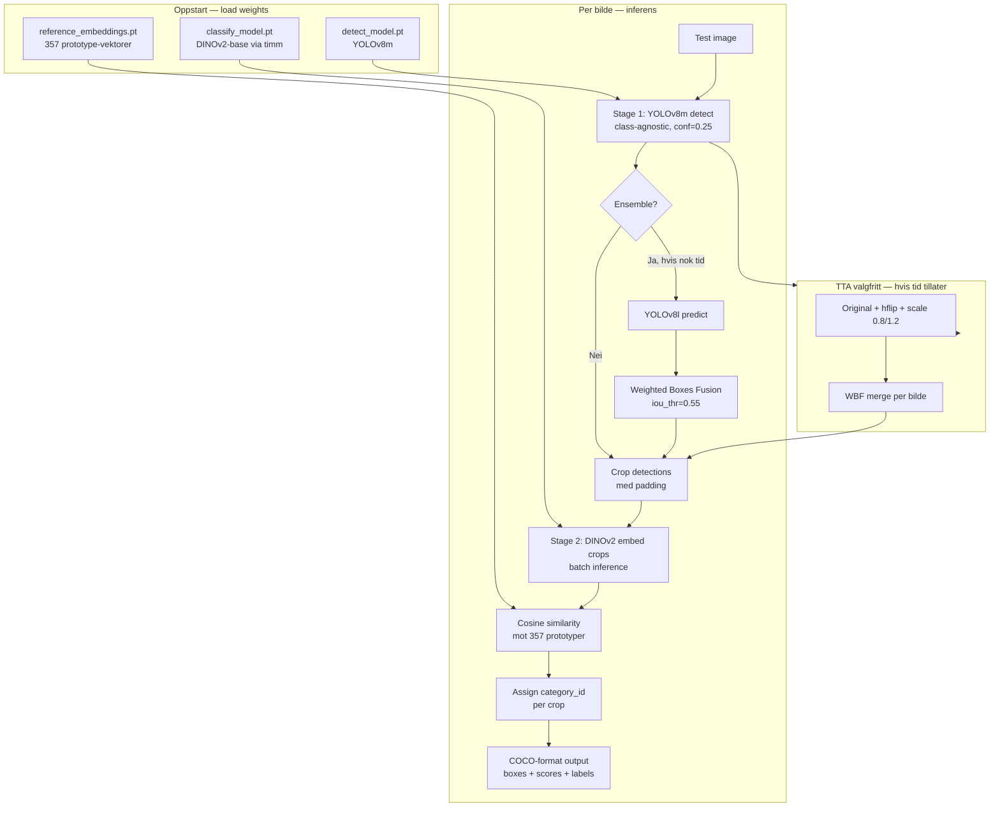
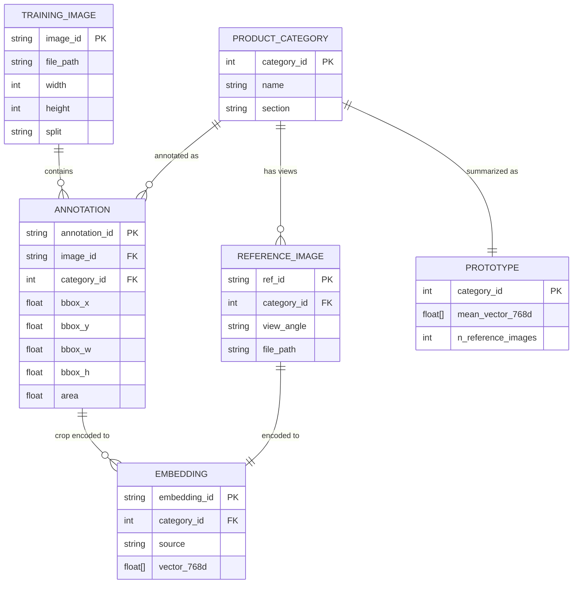

# Teknisk Arkitektur: NorgesGruppen Object Detection — NM i AI 2026

> Utarbeidet: 2026-03-19 | Basert på: research/norgesgruppen-object-detection-2026-03-19.md

---

## Oppsummering

Med 254 treningsbilder og 357 produktkategorier er dette et ekstremt data-fattig, finkornet deteksjonsproblem. End-to-end 357-klasse YOLO vil feile — for mange klasser, for lite data. Vinnende strategi er en **two-stage pipeline**: (1) klasse-agnostisk YOLOv8m-detektor som lokaliserer alle produkter, (2) DINOv2-embedding-basert nearest-neighbor-klassifikasjon mot referansebilder. Scoringsvekten (0.7 × deteksjon + 0.3 × klassifikasjon) betyr at deteksjonskvalitet er det primære optimaliseringsmålet. Realistisk målscore: 47-62% combined mAP@0.5. Alt trenes lokalt og pakkes i submission.zip — ingen treningskode kjøres i sandbox, kun inferens.

---

## Systemarkitektur

### Treningspipeline (lokalt)

```mermaid
graph TB
    subgraph Input["Treningsdata"]
        A[254 hyllebilder<br/>22 300 COCO annotations]
        B[327 referansebilder<br/>7 vinkler per produkt]
    end

    subgraph Augmentation["Data Augmentation"]
        C[YOLOv8 built-in<br/>mosaic, mixup, HSV, flip]
        D[Custom Copy-Paste<br/>referansebilder på hyllebilder]
        E[Albumentations<br/>CLAHE, shadow, noise, dropout]
    end

    subgraph Detection["Stage 1: Deteksjonstrening"]
        F[Konverter alle annotations<br/>til 1 klasse: 'product']
        G[YOLOv8m — 640px<br/>200 epochs, AdamW]
        H[YOLOv8l — 640px<br/>150 epochs, AdamW]
        I[YOLOv8m — 1280px<br/>100 epochs, AdamW]
    end

    subgraph Classification["Stage 2: Embedding-database"]
        J[timm DINOv2-base<br/>vit_base_patch14_dinov2]
        K[Generer embeddings<br/>for alle 327 x 7 referansebilder]
        L[Beregn prototype-vektorer<br/>mean per produktkategori]
        M[reference_embeddings.pt<br/>~2MB]
    end

    subgraph Validation["Validering"]
        N[Train/val split 80/20<br/>Stratified per section]
        O[Two-stage pipeline test<br/>detect → crop → classify]
        P[mAP@0.5 per stage<br/>+ combined score]
    end

    subgraph Output["Submission artifacts"]
        Q[detect_model.pt ~50MB]
        R[classify_model.pt ~346MB]
        S[reference_embeddings.pt ~2MB]
        T[run.py]
    end

    A --> C
    A --> D
    B --> D
    C --> F
    D --> F
    E --> F
    F --> G
    F --> H
    F --> I
    B --> J
    J --> K
    K --> L
    L --> M
    G --> N
    H --> N
    I --> N
    N --> O
    O --> P
    G --> Q
    J --> R
    M --> S
```

### Inferenspipeline (sandbox, kjøres i run.py)



---

## Tech Stack

| Lag | Teknologi | Begrunnelse |
|-----|-----------|-------------|
| Deteksjon | YOLOv8m (ultralytics 8.1.0) | Pre-installert i sandbox, bevist på retail-data, 50MB vekt, god augmentation-pipeline |
| Klassifikasjon | DINOv2-base via timm 0.9.12 | Beste embeddings for finkornet visuell likhet, k-NN gir 93.94% accuracy på retail per litteratur, pre-installert |
| Augmentasjon | YOLOv8 built-in + albumentations 1.3.1 | Begge pre-installert, komplementære styrker — YOLO-mosaic er kritisk for lite data |
| Ensemble | ensemble-boxes 1.0.9 (WBF) | Pre-installert, +1-3 mAP gratis |
| Nearest neighbor | torch.cosine_similarity + argmax | Enkelt, ingen ekstra avhengigheter, fungerer i sandbox |
| Lokal trening | PyTorch 2.6.0 + CUDA | Trenes lokalt (RTX 3090 / tilgjengelig GPU), pakkes som .pt weights |
| Packaging | Python pathlib + zipfile | Sandbox-krav: ingen os/subprocess/socket |
| Validering | ultralytics val() + sklearn metrics | Val-split for mAP tracking under trening |

**Hva som er utelatt og hvorfor:**

- **RF-DETR**: Beste COCO-score, men krever `pip install rfdetr` — blokkert i sandbox
- **CLIP**: Kun 48-62% zero-shot accuracy på retail-produkter uten fine-tuning — DINOv2 er bedre
- **Faster R-CNN**: Tregere, mer kompleks, ingen klar fordel over YOLOv8 for dette problemet
- **YOLOv8x**: For stor overfittingsrisiko med 254 bilder, 68M params vs 26M for m-variant

---

## Build vs Buy

| Komponent | Bygg selv | Open Source | Pre-installert | Anbefaling |
|-----------|-----------|-------------|----------------|------------|
| Objektdetektor | Scratch-trening COCO | YOLOv8m pretrained | ultralytics 8.1.0 | **Pre-installert + finjuster** — COCO-vekter gir mye gratis, 254 bilder er nok for fine-tuning |
| Feature extractor | - | DINOv2 self-supervised | timm 0.9.12 | **Bruk timm** — DINOv2 er SOTA for visuell likhet, ingen grunn til å trene fra scratch |
| Embedding store | - | numpy/torch arrays | torch | **Bygg selv** — 357 prototyper er 357 × 768 float32 = ~1MB, ingen fancy vector DB nødvendig |
| Copy-paste aug | Implementer selv | copy-paste-aug repo | Nei | **Bygg selv** — 50-100 linjer Python, albumentations + PIL, høy ROI (+5-10 AP) |
| Ensemble | - | WBF | ensemble-boxes 1.0.9 | **Pre-installert** — 10 linjer kode, +1-3% mAP gratis |
| TTA | Implementer selv | - | - | **Bygg selv** — 20 linjer, flip + scale + WBF merge |
| Data loader | ultralytics YAML | - | - | **Bruk ultralytics** — COCO-format støttes direkte |
| Metrics | ultralytics val() | - | - | **Bruk ultralytics** — mAP@0.5 beregnes automatisk |
| ONNX eksport | - | - | onnxruntime-gpu | **Fallback** — kun hvis .pt ikke laster i sandbox |

**AI-assistert utvikling endrer kalkylen:**
- Copy-paste augmentation og TTA-kode er 50-100 linjer hver — Claude Code skriver dette på minutter
- Referanse-embedding-pipeline er boilerplate timm-kode — genereres med AI raskt
- Custom dataloader for kopiert-lim-augmentasjon er det eneste som krever domeneforståelse

---

## Datamodell



**Merknader:**

- **split-felt** på TRAINING_IMAGE: stratified 80/20 split, ikke random — sørger for at sjeldne kategorier er representert i validation
- **view_angle** på REFERENCE_IMAGE: {main, front, back, left, right, top, bottom} — alle 7 embeddings bidrar til prototype mean
- **source** på EMBEDDING: {reference, training_crop} — skiller mellom referansebilder og crops fra treningsdata (brukt til evt. fine-tuning)
- **PROTOTYPE** er den operative datastrukturen i sandbox — lagres som reference_embeddings.pt som en dict {category_id: tensor_768d}
- **PII**: ingen persondata — kun produktbilder, ingen GDPR-hensyn
- **Seksjonsinndeling**: 4 seksjoner (Egg, Frokost, Knekkebroed, Varmedrikker) brukes som strukturell metadata, ikke som YOLO-klasser i primærmodellen

---

## Integrasjoner (treningssteg)

| Integrasjon | Hva | Hvorfor | Risiko | Alternativ |
|-------------|-----|---------|--------|------------|
| timm 0.9.12 | DINOv2-base pretrained vekter via Hugging Face cache | Feature extractor for klassifikasjon | Vekter må lastes ned lokalt FØR submission — sandbox har ingen nettverkstilgang | efficientnet_b3 (~12MB, lavere kvalitet) |
| ultralytics 8.1.0 | YOLOv8 training + inference | Detektor + augmentation pipeline | Versjonslås: 8.1.0 er eldre, noen nyere features ikke tilgjengelig | Direkte PyTorch Faster R-CNN |
| albumentations 1.3.1 | Augmentasjon (CLAHE, shadow, etc.) | Komplementerer YOLOv8 built-in | 1.3.1 er eldre — noen transforms har endret API | Torchvision transforms |
| ensemble-boxes 1.0.9 | Weighted Boxes Fusion | Multi-model ensemble | Minimal — WBF er stabilt bibliotek | Enkel NMS som fallback |
| PyTorch 2.6.0 / CUDA 12.4 | GPU-akselerert trening og inferens | Nødvendig for treningshastighet og 300s timeout | L4 = 24GB VRAM, ingen consumer GPU vi trener på lokalt | CPU-inference er for tregt for 300s timeout |

**Kritisk: DINOv2-vekter.**
timm laster `vit_base_patch14_dinov2` fra Hugging Face Hub ved første kall (`timm.create_model(..., pretrained=True)`). I sandbox er det ingen internettilgang. Løsning: last ned og cache vekter lokalt, pakk dem i submission.zip som classify_model.pt (via `torch.save(model.state_dict())`), og last inn med `pretrained=False` + `load_state_dict()` i run.py.

---

## Infrastruktur & Kostnad

| Fase | Kontekst | Beregningskostnad | Hovedposter |
|------|----------|-------------------|-------------|
| Lokal trening | Egen maskin med GPU | ~0 kr/time (sunk cost) | RTX 3090 eller bedre anbefalt. YOLOv8m 200 epochs ≈ 40-60 min |
| Cloud trening (fallback) | Google Colab Pro / Lambda Labs | ~50-150 kr per treningsøkt | A100: $1.29/t × 2t = $2.58/økt ≈ 28 kr. Nødvendig hvis lokal GPU er begrenset |
| Submission sandbox | NVIDIA L4 24GB, berøringstid ≤ 300s | 0 (inkludert i konkurransen) | L4 tilgjengelig, CUDA 12.4 |
| Konkurranseperiode | 3 submissions/dag, 2 uker | ~0-300 kr total | Kun cloud-trening hvis relevant |

**Vektbudsjett (420MB grense):**

```
submission.zip
├── detect_model.pt          ~49.7 MB    YOLOv8m weights (yolov8m.pt = 49.7MB)
├── classify_model.pt        ~346.0 MB   DINOv2-base state_dict (vit_base_patch14_dinov2)
├── reference_embeddings.pt  ~1.1 MB     357 × 768 float32 = ~1.05MB
└── run.py                   ~0.05 MB    Inferensskript
                             ---------
TOTAL                        ~397 MB     (23MB buffer til 420MB grense)
```

**Alternativt vektbudsjett hvis YOLOv8l ønskes:**

```
detect_model.pt              ~87.7 MB    YOLOv8l (87.7MB)
classify_model.pt            ~346.0 MB   DINOv2-base
reference_embeddings.pt      ~1.1 MB
TOTAL                        ~435 MB     OVERSTIGER grensen — bruk enten YOLOv8m eller bytt DINOv2-base til DINOv2-small (88MB)
```

**Vektbudsjett hvis ensemble (2 detektorer):**

```
detect_model_m.pt            ~49.7 MB    YOLOv8m
detect_model_l.pt            ~87.7 MB    YOLOv8l
classify_model.pt            ~88.0 MB    DINOv2-small (vit_small_patch14_dinov2)
reference_embeddings.pt      ~1.1 MB
TOTAL                        ~227 MB     Passer, men DINOv2-small gir lavere embedding-kvalitet
```

**Anbefaling**: Start med Option 1 (YOLOv8m + DINOv2-base). Evaluer om ensemble gir nok gevinst til å rettferdiggjøre nedgrade til DINOv2-small.

---

## Konkret treningsplan

### Rekkefølge og avhengigheter

```
Dag 1 — Infrastruktur og baseline
  ├── [ ] Sett opp lokal treningskatalog med COCO-formatdata
  ├── [ ] Konverter alle 22 300 annotations til 1-klasse ("product")
  ├── [ ] Lag train/val split (80/20, stratified per section)
  ├── [ ] Tren YOLOv8m baseline (ingen custom augmentasjon) — target: val mAP@0.5 > 30%
  ├── [ ] Last ned og cache DINOv2-base vekter lokalt
  └── [ ] Bygg embedding-pipeline: alle 327 × 7 referansebilder → prototyper

Dag 2 — Augmentasjon og deteksjonsforbedring
  ├── [ ] Implementer copy-paste augmentasjon med referansebilder
  │        (avhenger av: referansebilder lastet, baseline-datasett klar)
  ├── [ ] Tren YOLOv8m med full augmentasjon inkl. copy-paste
  ├── [ ] Sammenlign val mAP mot baseline
  └── [ ] Tren YOLOv8m imgsz=1280 for small-product boost

Dag 3 — Two-stage pipeline og klassifikasjon
  ├── [ ] Generer ground-truth crops fra val-bilder (bruk GT bboxes)
  │        (avhenger av: DINOv2 klar)
  ├── [ ] Test nearest-neighbor klassifikasjon mot prototyper på val-crops
  ├── [ ] Måle klassifikasjon mAP@0.5 isolert
  ├── [ ] Sammensett full to-stegs pipeline, mål combined score
  └── [ ] Vurder: fine-tune DINOv2 på crops + referansebilder?

Dag 4 — Ensemble og innlevering
  ├── [ ] Tren YOLOv8l variant (avhenger av: copy-paste aug klar)
  ├── [ ] Test WBF ensemble (m + l) vs single model
  │        (avhenger av: begge modeller trent)
  ├── [ ] Implementer TTA (flip + scale + WBF)
  ├── [ ] Lag submission.zip med run.py, verifiser 420MB grense
  ├── [ ] Verifiser at run.py kjører uten nettverkstilgang (ingen requests/huggingface)
  └── [ ] FØRSTE SUBMISSION

Dag 5+ — Iterasjon basert på leaderboard-feedback
  ├── [ ] Pseudo-labeling på test images (hvis public test set tilgjengelig)
  ├── [ ] Fine-tune klassifikator på ekstra crops
  └── [ ] Hyperparameter-søk på NMS-terskel og confidence cutoff
```

**Kritiske avhengigheter:**
1. DINOv2-vekter MÅ lastes ned og lagres lokalt FØR submission bygges
2. Copy-paste augmentasjon avhenger av at referansebilder er tilgjengelig i riktig format
3. Ensemble avhenger av at begge modeller er trent og validert individuelt
4. run.py MÅ testes uten internett i et isolert environment FØR innlevering

---

## Effort-estimat

### Tradisjonell utvikling

| Komponent | Tid |
|-----------|-----|
| Data setup: COCO-konvertering, split, YAML-config | 1 dag |
| Baseline YOLOv8m trening + validering | 0.5 dag |
| Copy-paste augmentasjon (implementasjon + test) | 2 dager |
| DINOv2 embedding-pipeline + prototype-beregning | 1.5 dager |
| Two-stage inferens-script (run.py) | 1 dag |
| Ensemble + TTA implementasjon | 1 dag |
| Submission packaging + sandbox-testing | 1 dag |
| Iterasjon basert på submissions | 2 dager |
| **Totalt** | **~10 dager** |

**Totalt tradisjonell: ~10 dager med 1 ML-utvikler**

### AI-assistert utvikling (Claude Code)

| Komponent | Tradisjonell | AI-assistert | Reduksjon | Forutsetning |
|-----------|-------------|--------------|-----------|--------------|
| Data setup: COCO-konvertering, split, YAML | 1 dag | 2 timer | 75% | Standard COCO format, kjent struktur |
| Baseline YOLOv8m trening + validering | 0.5 dag | 0.5 dag | 0% | Selve treningskjøringen er flaskehalsen, ikke kode |
| Copy-paste augmentasjon (implementasjon) | 2 dager | 3 timer | 85% | Boilerplate PIL/albumentations kode |
| DINOv2 embedding-pipeline | 1.5 dager | 2 timer | 85% | Standard timm-kode + torch-operasjoner |
| Two-stage inferens-script (run.py) | 1 dag | 3 timer | 75% | Ren pipeline-kode, ingen domenelogikk |
| Ensemble + TTA | 1 dag | 2 timer | 80% | Godt dokumentert WBF-API |
| Submission packaging + sandbox-testing | 1 dag | 3 timer | 75% | Sandbox-krav er kjente constraints |
| Iterasjon og feilsøking | 2 dager | 1 dag | 50% | Debugging av edge cases variabelt |
| **Totalt** | **~10 dager** | **~3 dager** | **~70%** | 1 utvikler med AI-verktøy |

**Totalt AI-assistert: ~3 dager kode + ~2-3 dager treningskjøring = ~5-6 dager kalender**

### Estimat-forutsetninger

- Treningskjøring (GPU-tid) er ikke påvirket av AI-assistanse — 40-90 min per YOLOv8-run er konstant
- AI-gevinsten er størst på boilerplate: data-konvertering, embedding-pipeline, packaging
- Domenespesifikk kunnskap (riktig augmentasjonsstyrke, NMS-terskler, confidence cutoff) krever eksperimentering
- Forutsetter at DINOv2-vekter er tilgjengelig og lar seg laste korrekt i sandbox — dette MÅ verifiseres tidlig
- run.py sandbox-constraints (ingen os/subprocess/socket) legger til noe overhead i testing
- "Iterasjon" er vanskelig å estimere — leaderboard-feedback kan trigge store arkitekturendringer

---

## Arkitekturbeslutninger (ADRs)

### ADR-1: Klasse-agnostisk detektor (1 klasse) fremfor 357-klasse detektor

- **Kontekst:** 254 bilder fordelt på 357 kategorier gir ~0.7 bilder per klasse i gjennomsnitt. YOLO med 357 klasser vil ha mesteparten av klassehodet treningsdatafri.
- **Beslutning:** Tren YOLOv8m med 1 klasse ("product") på alle 22 300 annotations. Klassifisering gjøres i et separat steg.
- **Konsekvenser:** Deteksjon mAP@0.5 vil være signifikant høyere enn 357-klasse alternativet. Ulempen er at vi mister end-to-end treningssignal — klassifikasjonsfeil påvirker ikke detektor. Scoring-formelen (0.7 × deteksjon) gjør denne trade-offen gunstig.

### ADR-2: DINOv2 nearest-neighbor klassifikasjon fremfor fin-tunet klassifikator

- **Kontekst:** For fin-tuning av en 357-klasse klassifikator trenger vi treningsdata per klasse. Med referansebilder har vi 7 bilder per klasse — svært lite for supervised learning uten regularisering.
- **Beslutning:** Bruk DINOv2 feature extractor (frozen weights) med nearest-neighbor mot prototype-vektorer (mean av referansebilder). Ingen treningssteg for klassifikatoren i baseline.
- **Konsekvenser:** Inference er rask (cosine similarity er O(n) med n=357). DINOv2 er spesifikt trent for visuell likhet via self-supervision — k-NN på retail gir 93.94% accuracy i litteraturen. Ulempen: ingenting er fine-tuned på NorgesGruppen-spesifikke produkter. Forbedring i iterasjon: fine-tune DINOv2 på crops fra treningsdata kombinert med referansebilder.

### ADR-3: YOLOv8m som primærmodell, ikke YOLOv8l eller YOLOv8x

- **Kontekst:** L4 GPU har 24GB VRAM. YOLOv8l og x gir høyere COCO-score, men har mer overpassingsrisiko på 254 bilder. Vektbudsjettet er 420MB.
- **Beslutning:** YOLOv8m (49.7MB) er primærmodell. YOLOv8l (87.7MB) vurderes som andre detektormodell i ensemble, men kun hvis DINOv2 byttes til small-variant (88MB) for å holde seg under 420MB.
- **Konsekvenser:** YOLOv8m gir lavere ceiling enn x, men lavere overfittingsrisiko. Med 254 bilder er regularisering viktigere enn modellkapasitet. Ensemblet (m + l + DINOv2-small) gir potensielt +1-3% mAP men ofrer klassifikasjonsembedding-kvalitet.

### ADR-4: Weights pakkes offline, ingen treningskode i run.py

- **Kontekst:** Sandbox timeout er 300 sekunder. YOLOv8m trening tar 40-90 minutter. DINOv2 Hugging Face download er blokkert.
- **Beslutning:** All trening skjer lokalt. run.py inneholder KUN inferenskode: load weights → detect → crop → embed → classify → output. Weights lagres i .pt-filer i submission.zip.
- **Konsekvenser:** 300s timeout er tilstrekkelig for inferens (YOLOv8m batch inference er rask på L4). Ulempen: vi kan ikke gjøre online adaptering i sandbox. DINOv2-vekter MÅ eksporteres korrekt (state_dict, ikke full model med Hugging Face metadata) for å laste uten nettverkstilgang.

### ADR-5: Copy-paste augmentasjon implementeres custom, ikke via YOLOv8 innebygd

- **Kontekst:** YOLOv8 har en `copy_paste`-parameter, men den fungerer kun med segmenteringsmasker, ikke bounding boxes. Vi har kun bboxes i COCO-datasettet.
- **Beslutning:** Implementer custom copy-paste: last referansebilde, crop produktet med bbox + padding, paste på tilfeldig posisjon i treningsbilde, oppdater annotations med ny bbox.
- **Konsekvenser:** +5-10 AP i low-data regime (Google Brain CVPR 2021). Høy ROI for ~50-100 linjers implementasjon. Ulempen: ingen automatisk segmentering = litt kant-artefakter fra rektangulær crop. GrabCut kan forbedre dette men er mer komplekst.
